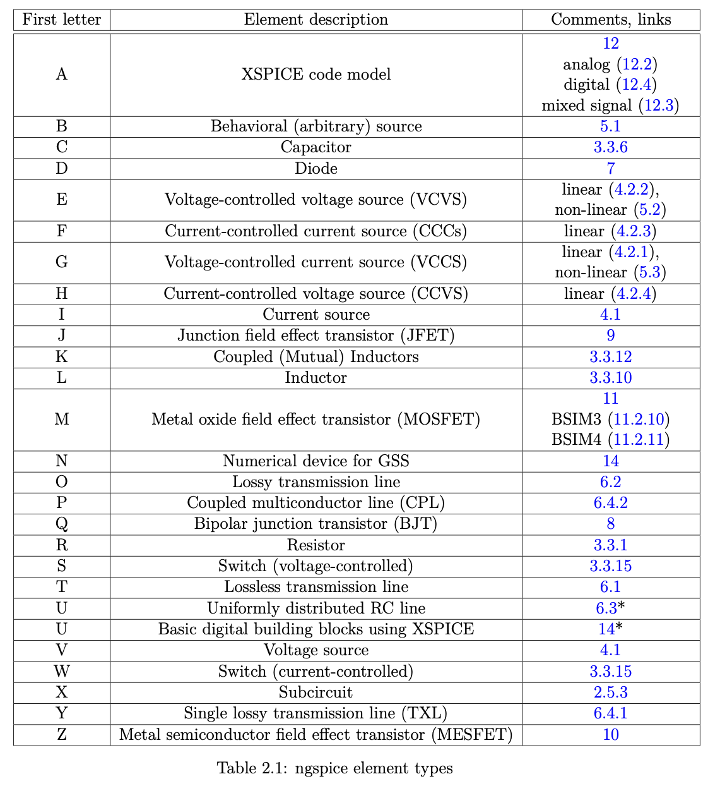
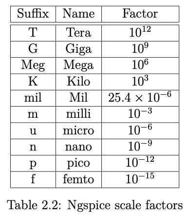

# NGSpiceInterface
Easy and lightweight ngspice shared lib C++interface

For more information please check original ngspice manual https://ngspice.sourceforge.io/docs/ngspice-38-manual.pdf

# Some pictures

# Dot commands
.AC start an ac simulation (15.3.1).

.CONTROL start a .control section (16.4.3).

.CSPARAM define parameter(s) made available in a control section (2.11). .DC start a dc simulation (15.3.2).

.DISTO start a distortion analysis simulation (15.3.3).

.ELSE conditional branching in the netlist (2.13).

.ELSEIF conditional branching in the netlist (2.13).

.END end of the netlist (2.3.2).

.ENDC end of the .control section (16.4.3).

.ENDIF conditional branching in the netlist (2.13).

.ENDS end of subcircuit definition (2.5.2).

.FOUR Fourier analysis of transient simulation output (15.6.4).

.FUNC define a function (2.10).

.GLOBAL define global nodes (2.6).

.IC set initial conditions (15.2.2).

.IF conditional branching in the netlist (2.13).

.INCLUDE include part of the netlist (2.7).

.LIB include a library (2.8).

.MEAS measurements during the simulation (15.4).

.MODEL list of device model parameters (2.4).

.NODESET set initial conditions (15.2.1).

.NOISE start a noise simulation (15.3.4).

.OP start an operating point simulation (15.3.5).

.OPTIONS set simulator options (15.1).

.PARAM define parameter(s) (2.9).

.PLOT printer plot during batch simulation (15.6.3).

.PRINT tabular listing during batch simulation (15.6.2).

.PROBE save device currents, voltages and differential voltages (15.6.5).

.PSS start a periodic steady state analysis (15.3.12).

.PZ start a pole-zero analysis simulation (15.3.6).

.SAVE name simulation result vectors to be saved (15.6.1).

.SENS start a sensitivity analysis (15.3.7).

.SP S parameter analysis (15.3.8).

.SUBCKT start of subcircuit definitions (2.5).

.TEMP set the ciruit temperature (2.12).

.TF start a transfer function analysis (15.3.9).

.TITLE title of the netlist (2.3.1).

.TRAN start a transient simulation (15.3.10).

.WIDTH width of printer plot (15.6.7).

# Plots
Different plots vectors are accessed with plot.vector, e.g.

ac1.frequency